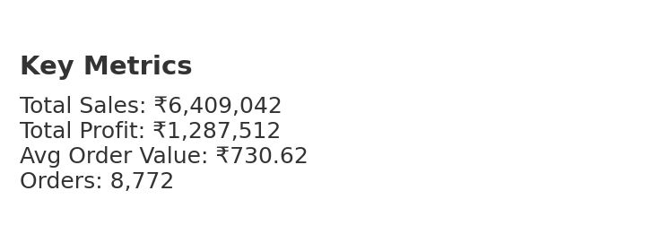
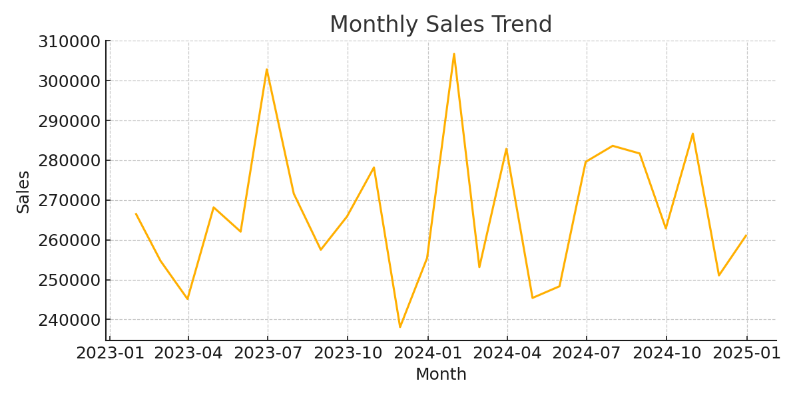
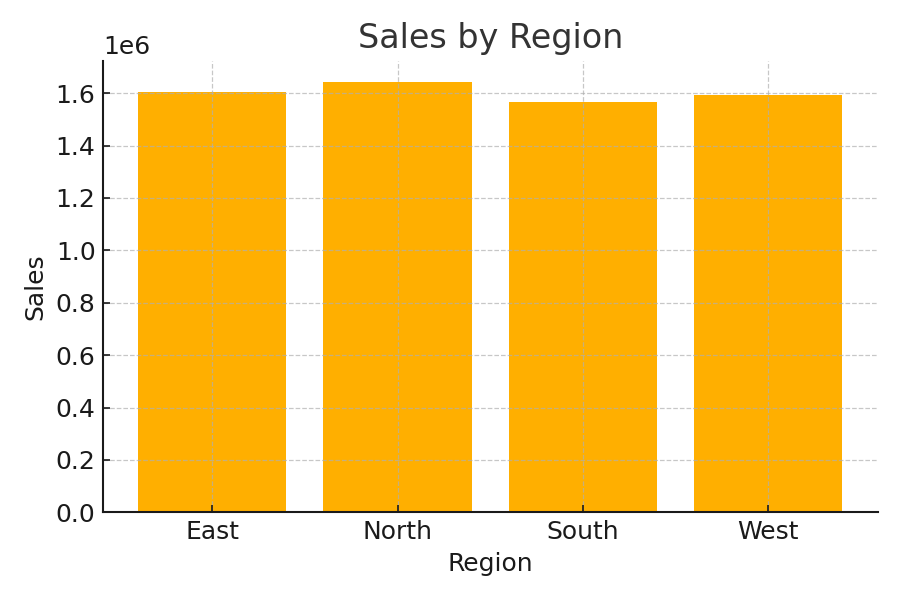
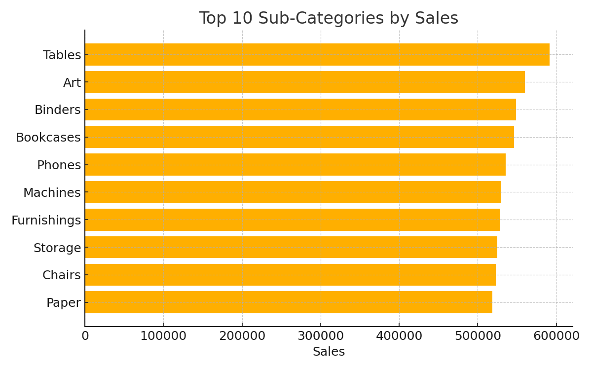
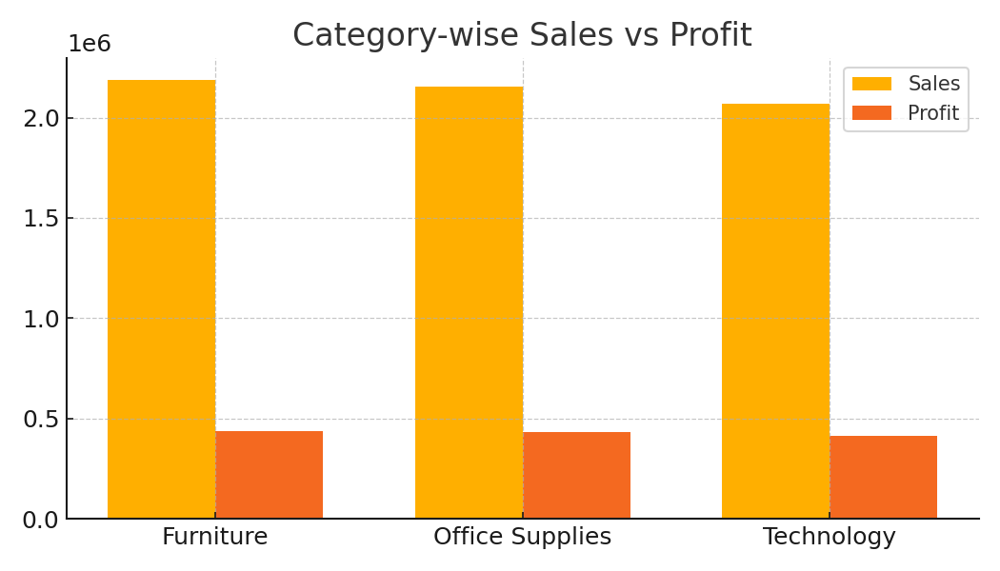

# Sales & Revenue Dashboard (Portfolio Project)

A professional **Sales & Revenue Dashboard** project to showcase Data Analytics skills.

## 🔎 Highlights
- Data cleaning (Excel / Python / Power BI)
- KPIs: Sales, Profit, Orders, AOV
- Dashboards with trends, regions, categories, products
- Ready for GitHub, LinkedIn, or freelancing portfolios

## 🗂️ Structure
```
data/superstore_sales.csv
images/
  kpi_summary.png
  monthly_sales_trend.png
  sales_by_region.png
  top_products.png
  category_sales_profit.png
src/ (placeholder for scripts)
README.md
```

## 📊 Visuals






## 📈 Quick KPIs
- Total Sales: ₹6,409,042
- Total Profit: ₹1,287,512
- Avg Order Value: ₹730.62
- Orders: 8,772

## 📄 Talking Points (for LinkedIn/Clients)
- **Problem:** Businesses need to know which products/regions drive growth.
- **Solution:** Built a dashboard to visualize sales & profit trends by region, category, and product.
- **Impact:** Helps decision-making in marketing & inventory planning.

## ⚙️ Tools
- Excel / Power Query
- Power BI / Tableau
- Python (pandas, matplotlib)

## 📄 License
MIT — free to use and share.
